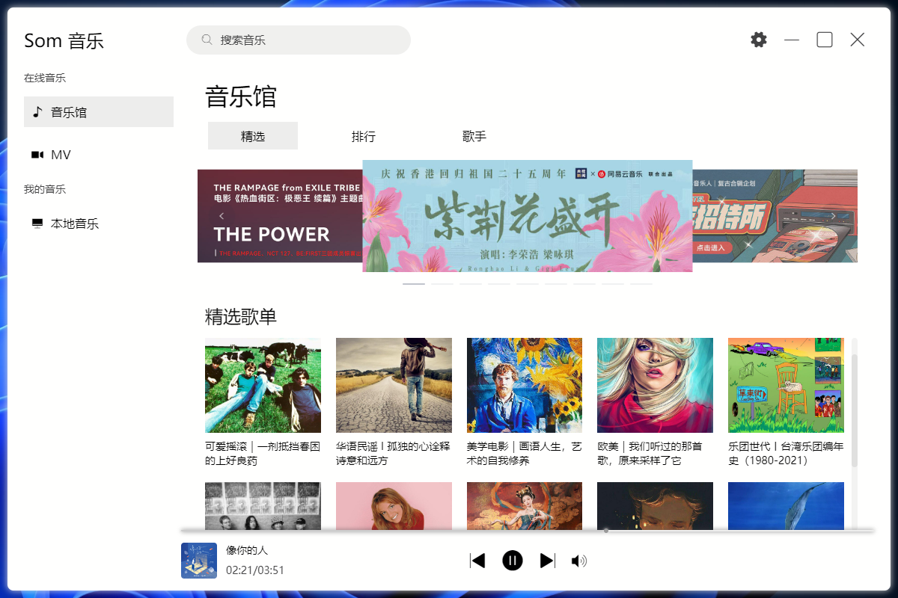
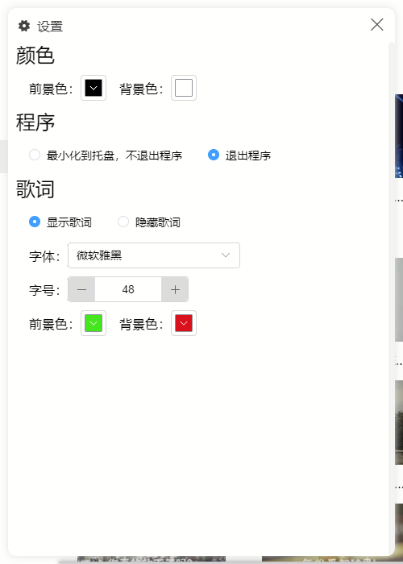
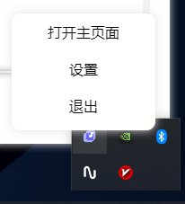
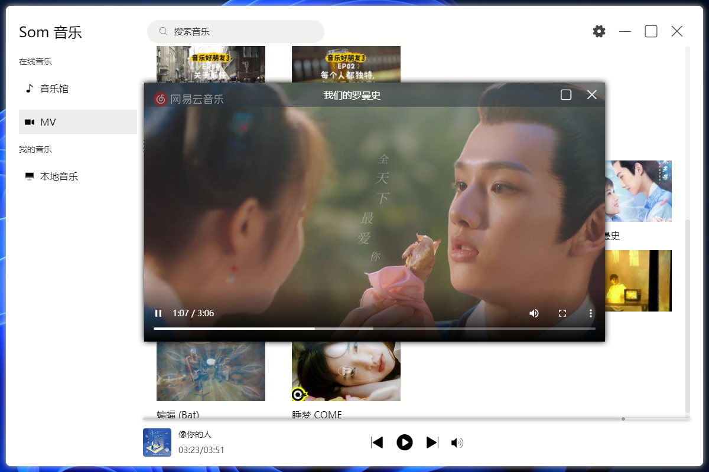

#### 介绍
基本的音乐播放器功能,超小的运行环境不到2MB。
2022-06-22
目前实现了精选、排行榜、歌星、歌词
2022-06-30
1. 新增设置功能：
    1. 自定义主题颜色，拖动选择器实时更新所有窗口颜色变化
    2. 程序配置支持退出、托盘
    3. 歌词主题自定义，支持实时更新变化
2. 新增托盘功能和托盘菜单功能（适应主题）
3. 新增MV视频
4. 优化歌词渲染方式

接口端依赖网易云音乐 API https://github.com/Binaryify/NeteaseCloudMusicApi 项目，需先启动接口端才可正常运行。

启动命令：`npm run dev`

#### 截图预览

